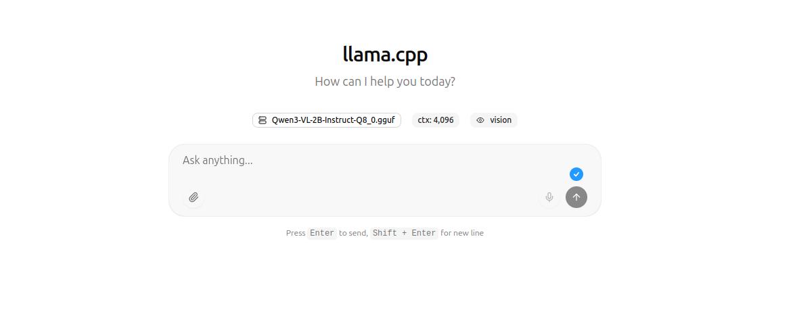

# wolfi-llama
A container image based on Wolfi OS for running OSS LLMs via llama.cpp

Full tutorial available [here](https://eheidi.dev/posts/raspberry-llama/).

## Usage
Download `.gguf` models from [huggingface](https://huggingface.co/) and place them in the `models` folder. Then run the image using a volume to share the models and a port redirect (for the server).

## Example 1: Running Qwen3 VL with a web chat interface (personal assistant like ChatGPT)

### 1. Download the Models

- [unsloth Qwn3 VL models](https://huggingface.co/collections/unsloth/qwen3-vl)
-  What I used:
   - https://huggingface.co/unsloth/Qwen3-VL-2B-Instruct-GGUF
   - Smaller version that runs on Raspberry Pi 5
   - You need to download also the `mmproj` file to use image capabilities

Feel free to experiment with larger models, but keep in mind memory limitations.

### 2. Build the Image

```bash
docker build . -t wolfi-llama
```
This might take several minutes depending on the platform. Once the image is built you can run it with  Docker.

### 3. Running the Image

Run the image with default entrypoint (llama-server) on port `8000` and create a port redirect so you can access it from your local network:

```bash
docker run --rm --device /dev/dri/card1 --device /dev/dri/renderD128 -v ${PWD}/models:/models -p 8000:8000 wolfi-llama:latest --no-mmap --no-warmup -m /models/Qwen3-VL-2B-Instruct-Q8_0.gguf --mmproj /models/mmproj-F32.gguf --port 8000 --host 0.0.0.0 -n 512
```

You can also include the [recommended settings](https://docs.unsloth.ai/models/qwen3-vl-how-to-run-and-fine-tune#recommended-settings) for this specific model:

```bash
docker run --rm --device /dev/dri/card1 --device /dev/dri/renderD128 -v ${PWD}/models:/models -p 8000:8000 wolfi-llama:latest --no-mmap --no-warmup -m /models/Qwen3-VL-2B-Instruct-Q8_0.gguf --mmproj /models/mmproj-F32.gguf --port 8000 --h
ost 0.0.0.0 -n 512 --temp 0.7 --top-p 0.8 --top-k 20 --presence-penalty 1.5
```

Once the container is up and running and all services initialized, you can access the chat via `localhost:8000` or `local_network_ip:8000`.

You should get a page like this:



You should be able to use the image features, just keep in mind that large images consume a lot of tokens (so it takes a longer time to process as part of the prompt), so consider shrinking / optimizing your pictures before you use them in the prompt.


## Example 2: Using Docker Compose

The included `docker-compose.yaml` file facilitates running a setup with pre-defined values. Check the file and modify the `command` line if you are using a different model or different parameters. Then, you can simply run:

```shell
docker compose up
```

And this will get the llama server up and running the same way as before.